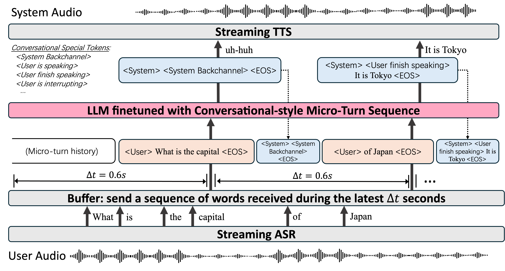

# DuplexCascade: Full-Duplex Speech-to-Speech Dialogue with VAD-Free Cascaded ASR-LLM-TTS Pipeline and Micro-Turn Optimization


<font size=7><div align='center'>[🎬 Demo Page](https://sbintuitions.github.io/DuplexCascadeDemo/) · [📄 Paper](https://arxiv.org/abs/2603.09180)</div></font>


## Contents <!-- omit in toc -->

- [Overview](#overview)
- [Evaluation Results](#evaluation-results)
- [Inference](#inference)
  - [Requirements](#requirements)
  - [Real-Time Demo](#real-time-demo)


## Overview

**DuplexCascade** is a full-duplex speech interaction model built on a cascaded **ASR–LLM–TTS** pipeline. It enables natural spoken dialogue while preserving the strong intelligence of a text-based LLM. 

### Key Features

* **Cascaded ASR–LLM–TTS Pipeline**
  DuplexCascade adopts a streaming cascaded architecture: the streaming ASR continuously transcribes user speech, the recognized text is periodically sent to the LLM for reasoning, and the generated response is synthesized in real time by a streaming TTS model. This design combines modularity with strong conversational capability. 

* **Micro-Turn Interaction**
  Instead of waiting for full utterances, DuplexCascade breaks dialogue into short, interleaved micro-turns. This allows faster bidirectional exchange and makes the interaction feel more natural and responsive.  


* **VAD-Free Turn-Taking Control**
  Unlike conventional cascaded systems that rely on an external Voice Activity Detection (VAD) module for turn-taking, DuplexCascade lets the LLM decide when to wait, respond, or backchannel. It does this by generating special conversational control tokens based on the incoming text stream, leading to more flexible and robust turn-taking behavior.  

* **Strong Full-Duplex Performance**
  DuplexCascade achieves strong turn-taking performance in full-duplex dialogue benchmarks while remaining competitive in conversational intelligence, showing that a cascaded design can support both natural interaction and capable language understanding.  

* **Text-Only Training with Strong Intelligence Retention**
  Traditional full-duplex spoken dialogue models often suffer from degraded intelligence because they jointly model text and audio tokens. In contrast, DuplexCascade only fine-tunes the LLM on text-based dialogue data, which allows it to support full-duplex interaction while largely preserving the original reasoning and instruction-following ability of the backbone LLM.  





## Evaluation Results

- Full-Duplex-Bench Results


- VoiceBench Results


## Inference

### Requirements

To run DuplexCascade-PT, set up the Python environment (the unsloth venv has all
deps) and install the three service dependencies:

```bash
# inside the venv (e.g. /home/penhfel/unsloth_uv/bin/python)
pip install websockets faster-whisper pocket-tts
```

### Real-Time Demo

DuplexCascade-PT requires four components: the LLM (llama.cpp), ASR
(faster-whisper), TTS (pocket-tts), and the bridge. Use the orchestration script:

```bash
./run_services.sh
```

This launches (see `run_services.sh` for overrides via env vars):
1. **llama-server** (:8080) serving the fine-tuned `DuplexCascade-PT-q4_k_m.gguf`.
   The `-sp` flag is REQUIRED so the duplex special tokens
   (`<|user is speaking|>`, `<|user finish speaking|>`, ...) are emitted in the
   completions output.
2. **STT** (services/stt_service.py, :31607) — faster-whisper `small`, pt.
3. **TTS** (services/tts_service.py, :31608) — pocket-tts `portuguese`, voice
   `rafael`, 24 kHz streaming.
4. **Bridge** (DuplexCascade/server.py, :31606) — serves the web demo, wires
   browser ↔ STT ↔ llama.cpp ↔ TTS.

After all services are ready, open the demo:

```bash
http://0.0.0.0:31606
```

To launch manually:

```bash
# 1) LLM (llama.cpp, OpenAI-compatible) — -sp for duplex special tokens
llama-server -m /mnt/f/duplex_cascade_runs/continue/export/gguf/DuplexCascade-PT-q4_k_m.gguf \
  --port 8080 --host 127.0.0.1 -c 8192 --parallel 1 -sp

# 2) STT
python services/stt_service.py --port 31607 --model medium

# 3) TTS
python services/tts_service.py --port 31608 --language portuguese

# 4) bridge / web demo
python DuplexCascade/server.py --port 31606 \
  --stt-ws ws://127.0.0.1:31607 \
  --tts-ws ws://127.0.0.1:31608 \
  --llm-api-base http://127.0.0.1:8080/v1
```

## Storage layout

The trained model runs are large (~46 GB) and live on the **HDD** mounted at
`/mnt/f` (a Windows `F:\` drive) to save SSD space:

```
/mnt/f/duplex_cascade_runs/
├── full/       # original QLoRA fine-tune (M2) - base for continuation
│   └── export/gguf/DuplexCascade-PT-q4_k_m.gguf
└── continue/   # continuation fine-tune with longer-response data (M3)
    └── export/gguf/DuplexCascade-PT-q4_k_m.gguf   # <-- default served model
```

- `run_services.sh` and `logs/run_llama.sh` default to the `continue` GGUF
  (the latest model) with fallback to `full`.
- All scripts honor the `RUNS_ROOT` env var, e.g.
  `RUNS_ROOT=/some/other/path ./run_services.sh`, so you can relocate the runs
  without editing code.
- To serve the earlier (pre-continue) model explicitly:
  `GGUF=/mnt/f/duplex_cascade_runs/full/export/gguf/DuplexCascade-PT-q4_k_m.gguf ./run_services.sh`
- The adapter, `merged_bf16`, and `model_state.safetensors` under each run are
  intermediate training/export artifacts; only the GGUF is needed at runtime.

`continue_finetune.sh` also reads/writes runs from `RUNS_ROOT`, so continuing
the fine-tune keeps everything on the HDD.


## Citation

If you use DuplexCascade in your research or project, please cite:

```bibtex
@article{yang2026duplexcascade,
  title={DuplexCascade: Full-Duplex Speech-to-Speech Dialogue with VAD-Free Cascaded ASR-LLM-TTS Pipeline and Micro-Turn Optimization},
  author={Jianing Yang and Yusuke Fujita and Yui Sudo},
  journal={arXiv preprint arXiv:2603.09180},
  year={2026}
}
```


## License

[MIT](./LICENSE)


## Related Works

This repository is closely related to several excellent open-source projects:

* **[delayed-streams-modeling](https://github.com/kyutai-labs/delayed-streams-modeling)**

* **[Full-Duplex-Bench](https://github.com/DanielLin94144/Full-Duplex-Bench)**

* **[VoiceBench](https://github.com/MatthewCYM/VoiceBench)**


